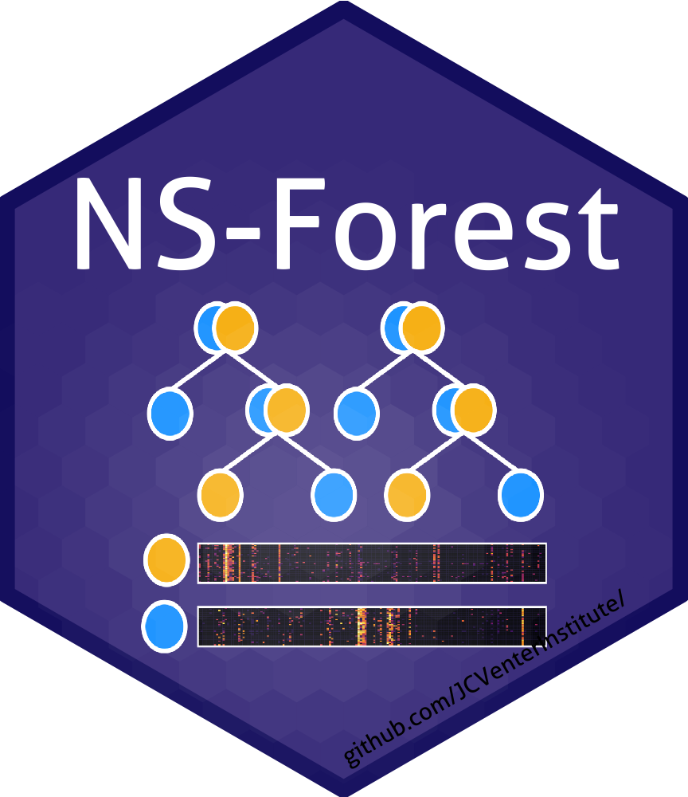

# lncRNA NS-Forest Documentation

This research was performed at the Scheuermann Lab during Summer 2026 by Sasha "Vik" Becker, a DSI scholar and graduate student at the George Washington University. This directory encompasses a summarized version of my work. Thank you to Dr. Scheuermann, Dr. Xu, Dr. Pankajam, and all others within the Scheuermann lab for your encouragement and support. 

## Directory Structure

- **The raw, clean, and preprocessed data isn't contained in this directory due to storage limitations. Please reach out to Dr. Bingfang Xu for access or reproduce through the following:**
    - `data_raw`: Raw data as-downloaded from its source.
        - *Download from the linked pages in the "Data Collection" section.*
    - `data_clean`: Filtered and/or downsampled Cell x Gene data. More details are located in `scripts_ipynb/data_cleaning.ipynb`.
        - *Run relevant sections of the aforementioned notebook*
    - `data_preprocessed`: Preprocessed Cell x Gene data with only positive genes (non-uniform expression in at least one cell type) and their cluster medians/binary stores. Optionally subset into lncRNA and protein-coding gene sets.
        - *Run the desired NS-Forest pipeline.*
    - **Data Storage Notes:**
        - This project requires a fair amount of memory in storage, depending on the size of the datasets. If you're running all pipelines on all tissues, storing all preprocessed subsets, the storage requirements explode to around 300Gb.
            - *This estimate is disregarding raw data storage, which adds an additional 100Gb.*
        - Analysis scripts only require the files for the clean data or preprocessed data of the full set (~150Gb in total). I recommended discarding the raw data after cleaning, as it can always be redownloaded, and storing/running this directory with HPC.
        - Within the scripts that run NS-Forest, you may toggle the variable `store_preprocessed_subset` should you wish to save them separately, but this is not recommended.
- `data_clean`: Filtered and/or downsampled Cell x Gene data. More details are located within `scripts_ipynb/data_cleaning.ipynb`.
- `data_preprocessed`: Preprocessed Cell x Gene data with only positive genes (non-zero median expression in at least one cell type) and their cluster medians/binary stores. Subset into full and lncRNA gene sets.
- `data_gencode_annotation`: Annotation CSVs from Gencode VM36 and v47. Used to annotate the M1 and MTG data.
- `dist`: NS-Forest v4.1 distribution/package.
- `docs`: NS-Forest documentation.
- `nsforest`: Local directory of NS-Forest modules.
- `output_biowulf`: Output data/figures directly from biowulf.
    - `aggregated`: Datasets that contain aggregated information across tissues.
    - `{tissue}`: Full output from NS-Forest runs using that tissue dataset.
        - *In future, should there be multiple datasets with same tissue, suffix the file name with an identifier.*
    - `terminal`: Terminal output from Biowulf. Includes errors, warnings, etc.
- `output_figures`: Aggregated figures, NS-Forest figures, and methods figure.
- `output_tables`: Complete and poster tables.
- `presentations`: Presentations and posters related to project. All presentations are prefixed with date given.
- `scripts_ipynb`: All .ipynb files, including drafts. Includes notebook for cleaning data (filter/downsample), analysis of cleaned data, and analysis of preprocessed data.
- `scripts_py`: All .py files, including drafts. All scripts ready for Biowulf submission, using commented template on line 1 as a guide. Alter pathing as necessary for your biowulf directory.
- `scripts_r`: All .Rmd files. Generation of plots for cluster medians, binary scores, and performance metrics.
- `scripts_slurm`: Slurm scripts for Biowulf runs. Categorized into `runs_full_lnc`, `runs_coding`, and `runs_coding_downsample`.
    - *Don't recommend running as swarm due to scaling memory requirements across datasets.*
    - 

## Data Collection

| Neural vs Non-Neural | Tissue | Citation (raw data link) | File Name | Number of Cell Types | Number of Cells (raw) | Number of Cells (post-filter and   downsampled) |
|:-:|:-:|:-:|:-:|:-:|:-:|:-:|
| Non-Neural | Bone Marrow | [Xu et al. (2023)](https://cellxgene.cziscience.com/collections/854c0855-23ad-4362-8b77-6b1639e7a9fc) | Bone_marrow | 45 | 66.6k | 66.6k |
| Non-Neural | Breast | [Reed et al. (2024)](https://cellxgene.cziscience.com/collections/48259aa8-f168-4bf5-b797-af8e88da6637) | HBCA - global | 42 | 803.2k | 507.0k |
| Non-Neural | Kidney | [Lake et al. (2023)](https://cellxgene.cziscience.com/collections/bcb61471-2a44-4d00-a0af-ff085512674c) | Integrated Single-nucleus and Single-cell RNA-seq of the Adult Human Kidney | 75 | 304.6k | 107.7k |
| Non-Neural | Liver | [Xu et al. (2023)](https://cellxgene.cziscience.com/collections/854c0855-23ad-4362-8b77-6b1639e7a9fc) | Liver | 29 | 259.7k | 259.6k |
| Non-Neural | Lung | [Sikkema et al. (2023)](https://cellxgene.cziscience.com/collections/6f6d381a-7701-4781-935c-db10d30de293) | An integrated cell atlas of the human lung in health and disease (core) | 61 | 584.9k | 491.2k |
| Neural | Primary Motor Cortex (M1) | [BICCN (2021)](https://brain-map.org/our-research/cell-type-taxonomies/mammalian-primary-motor-cortex-taxonomy) | Taxonomy | 127 | 76.5k | 76.5k |
| Neural | Middle Temporal Gyrus (MTG) | [Hodge et al. (2019)](https://brain-map.org/our-research/cell-type-taxonomies/human-mtg-smart-seq-taxonomy) | Human Taxonomy | 75 | 15.9k | 15.6k |
| Neural | Retina | [Li et al. (2026)](https://cellxgene.cziscience.com/collections/4c6eaf5c-6d57-4c76-b1e9-60df8c655f1e) | snRNA-seq of human retina - all cells | 123 | 3.2M | 509.0k |
| Neural | Spinal Cord | [Takeuchi et al. (2025)](https://cellxgene.cziscience.com/collections/0986e4cd-7a58-405d-9b91-4b199bb4124e) | Spinal cord dataset | 43 | 62.7k | 28.6k |

## Methodology Outline

* **CxG Data Collection**
    * Selected cell type annotation with highest degree of granularity.
* **Environment**
    * Cleaning (py): numpy, pandas, scanpy, celltypist, bionty
    * NS-Forest (py): numpy, pandas, sklearn, plotly, time, tqdm.
    * Analysis (py): numpy, pandas, scanpy, scipy, statsmodels, pingouin, cliffs_delta, seaborn, matplotlib
    * Visualization (r): tidyverse, ggplot2, patchwork, oeli, desctools, stringr, knitr, ggextra
    * Random state seed of 0.
* **Data Cleaning / Tissue**
    * Load the complete data as backed
    * *Annotate genes* in datasets lacking gene type annotation (MTG and M1) and remove unannotated genes.
        * 50k -> 30k genes in those datasets.
    * *Filter cells* that are either unhealthy or have a cell type annotation of unknown/unclassified.
    * For datasets with greater than 500k cells, *downsampled* to $N_{tissue} = 500\,000 \pm 10\,000$ by the cell type annotation of interest
	    * Recursively find optimal cap for the cluster sizes to bring the total number of cells in tissue dataset within 2% of 500k.
        * Downsampled so that if the cluster size is below the cap $t$, all cells in the cluster are sampled. If the cluster size above the cap $t$, $t$ cells are randomly selected from the cluster.
    * *Write* cleaned data to disk.
* **NS-Forest / Tissue**
    * Import data and load into memory
    * *Normalize* and *scale* raw counts with `sc.pp.normalize_total(target_sum = 1e4)` and `sc.pp.log1p()`.
        * Raw counts unavailable for retina dataset; only normalized.
    * *Split* data into the full gene set and the lncRNA-only subset.
    * For each subset, perform *preprocessing*:
        * Perform PCA on normalized data
        * Compute dendrogram.
        * Compute cluster medians (produce gene x cluster matrix).
        * Compute binary scores (produce gene x cluster matrix).
        * Select positive genes, or genes whose cluster-level median expression is greater than 0 in at least one cluster.
        * Save preprocessed data to disk.
	* *Run NS-Forest*.
        * Default parameters.
        * High threshold
* **Analysis**
    * *Performance Metrics* (clusters)
        * Plot performance (precision, recall, f-score, on-target fraction) of the full gene and lncRNA sets for each cluster, stratified by tissue type (neural or non-neural).
        * Plot KDE, stratified by tissue type (neural or non-neural).
        * Calculate metric retention as lncRNA subset performance / full gene set performance.
    * *Binary Scores and Cluster Medians* (gene-cluster pairs)
        * Calculate proportion of zeros and percentage difference between the lncRNA and full gene sets, stratified by tissue type (neural or non-neural).
        * Calculate means and medians of non-zero values and the difference between the lncRNA and full gene sets, stratified by tissue type (neural or non-neural).
        * Calculate Cohen's d (gaussian parametric) and Cliff's Delta (nonparametric) measures of distribution separation between the lncRNA and full gene sets, stratified by tissue type (neural or non-neural).
            * Higher magnitude indicates higher degree of separation between the distributions.
            * If positive, lncRNA scores are larger; if negative, full gene set scores are larger.

## Key Results

*Note:* Referenced ables and figures are found in the poster. Please see `presentations/lncnsf_poster.pdf`.

**Table 1. Descriptive table of Cell x Gene data.**
* Neural tissues contain a larger proportion of positive lncRNAs, increasing the contribution of lncRNAs to candidate neural biomarkers pools and indicating comparably higher lncRNA expression in neural cell types.
* Neural tissues retain a larger average of candidate lncRNA biomarkers per cell type, reflecting greater diversity in cell type-specific lncRNA expression.

**Figure 1. Distribution of non-zero Binary Scores of a gene within a cell type.**
* There is some separation in distribution for the neural cells ($δ = 0.228$; lncRNA has higher Binary Scores) and negligible separation for the non-neural cells ($δ = -0.032$; full transcriptome has higher Binary Scores).
* In neural tissues, lncRNAs show a greater proportion of high Binary Scores compared with the full transcriptome, consistent with greater cell type-specific expression. 
* In non-neural tissues, Binary Score distributions are broadly comparable between gene sets, suggesting that the two are similarly specific.

**Figure 2. NS-Forest performance metrics by gene set and neural versus non-neural.**
* Restricting the gene set to lncRNAs overall reduces precision, indicating a loss of information when removing protein-coding genes.
* Better precision preservation in neural tissues suggests a greater retention of discriminatory information in the lncRNA gene set.

## Conclusions

* Neural tissues contain more candidate marker genes than non-neural tissues, with a larger contribution from lncRNAs, suggesting that lncRNAs are more highly expressed in neuronal cells.
* lncRNAs exhibit greater cell type specificity than the full transcriptome in neural tissues.
* Restricting analyses to lncRNAs generally  decreases the precision of NS-Forest classification, but the reduction is smaller in neural tissues than in non-neural tissues.
* lncRNAs may play a unique role in establishing the highly specific gene regulation necessary to generate the large number of distinct neuron cell subtypes.
* Future analyses of coding-only and downsampled gene sets will help determine and quantify differences in biomarker potential between lncRNA and coding genes.

# NS-Forest v4.1 Documentation

*Note*: The below is preserved from the original README.md for reference.

Documentation: https://nsforest.readthedocs.io/en/latest/

Citation: https://bmcmethods.biomedcentral.com/articles/10.1186/s44330-024-00015-2

## Download and installation

In terminal: 

```
git clone https://github.com/JCVenterInstitute/NSForest.git

cd NSForest

conda env create -f environment.yml

conda activate nsforest

pip install .
```

## Prerequisites
* This is a python script written and tested in python 3.11, scanpy 1.9.6.
* Other required libraries: numpy, pandas, sklearn, plotly, time, tqdm.

## Versions and citations

Earlier versions are managed in [Releases](https://github.com/JCVenterInstitute/NSForest/releases).  

Version 4.0:

Liu A, Peng B, Pankajam A, Duong TE, Pryhuber G, Scheuermann RH, Zhang Y. (2024) Discovery of optimal cell type classification marker genes from single cell RNA sequencing data. __*BMC Methods.*__  https://doi.org/10.1186/s44330-024-00015-2

Version 2.0:

Aevermann BD, Zhang Y, Novotny M, Keshk M, Bakken TE, Miller JA, Hodge RD, Lelieveldt B, Lein ES, Scheuermann RH. (2021) A machine learning method for the discovery of minimum marker gene combinations for cell-type identification from single-cell RNA sequencing. __*Genome Res.*__ https://pubmed.ncbi.nlm.nih.gov/34088715/

Version 1.3/1.0:

Aevermann BD, Novotny M, Bakken T, Miller JA, Diehl AD, Osumi-Sutherland D, Lasken RS, Lein ES, Scheuermann RH. (2018) Cell type discovery using single-cell transcriptomics: implications for ontological representation. __*Hum Mol Genet.*__ https://pubmed.ncbi.nlm.nih.gov/29590361/

## Authors

* Beverly Peng (bpeng@jcvi.org)
* Angela Liu (aliu@jcvi.org)
* Richard Scheuermann (richard.scheuermann@nih.gov)
* Yun (Renee) Zhang (yun.zhang@nih.gov)
* Brian Aevermann (baevermann@chanzuckerberg.com)

## License

This project is licensed under the [MIT License](https://github.com/JCVenterInstitute/NSForest/blob/master/LICENSE).

## Acknowledgments

* Allen Institute of Brain Science
* Brain Initiative Cell Census Network
* Chan Zuckerberg Initiative
* California Institute for Regenerative Medicine
* National Library of Medicine

